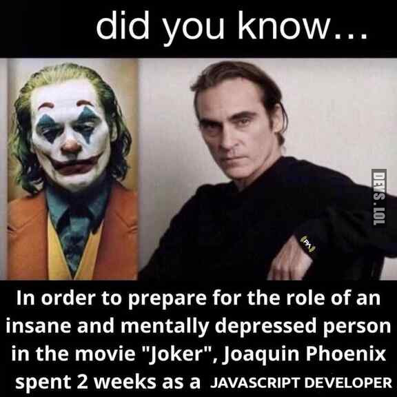

# Advanced-JS-Interactions

---
## MaTS

---
## About

In this project I am going to implement different js features like:
* Light mode/ dark mode
* Parallax carousel 

And many more 

---
### Learning objectives
#### Go checkout [my webpage](https://dengian.github.io/Advanced-JS-Interactions/) for all the details

---
### Goals
* A parallax carousel
* A collage with popup for more details
* Hover image above every Pokemon in the text
* Functional chaser or runner circle

---
### Nice to haves
* Chaser AND runner circle are functional
* Lightmode / Darkmode switch
* Final letter challenge completed!

---
### To-Do

---
### Reflection Time

---
### Useful resources 

---